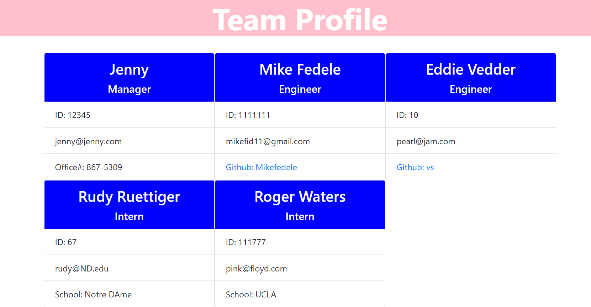

# Team-Profile-Generator
By Mike Fedele

## Table of Contents 

- [Description](#description)
- [Walk-thru](#Walk-thru)
- [Github](#screenshot)
- [credits](#credits)
- [license](#license)

## Description

An application to create a team profile with different cards depending on their position on the team. I tested this code using jest. 

## Walk-thru
[Walk-thru video](https://watch.screencastify.com/v/r9uE6GokwyC4Xqnh4koI)

## Github

   

## Credits
Mike Fedele
Contact me at: mikefid11@gmail.com

## License
MIT License    https://img.shields.io/badge/license-MIT-blue